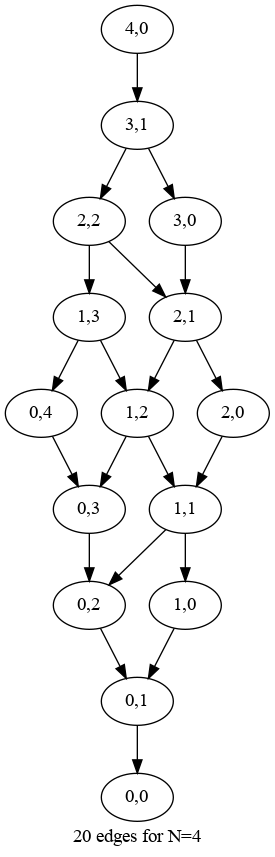
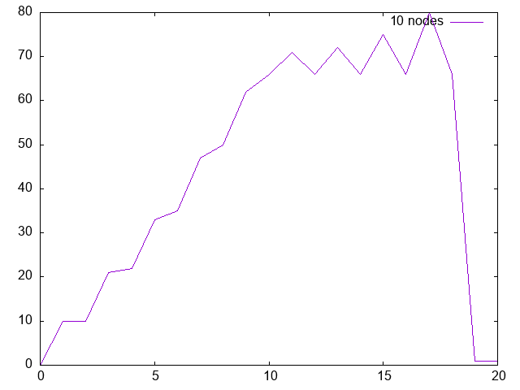
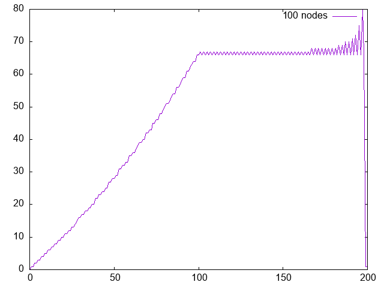

# pill-bottle

Experimenting with a simple probability problem produces an interesting function.

A medicine bottle contains `n` tablets and you are supposed to take a
half tablet per day. Every day, you draw at random from the bottle
either a half or a whole tablet.  If a half, it's consumed.  If it's a
whole, half is consumed and half is returned to the bottle. After `2n`
draws, the bottle is empty.

The question is, what are the odds of drawing a half tablet at every turn?

## Choices

The choices for `n=4` are at right.

Before the first draw, there are `n` wholes and 0 halves, which we can write as `(n,0)`.

After the first draw, one whole was consumed and one half returned to the bottle, so the second state is `(n-1, 1)`. The third draw gets interesting because in one world, a whole is chosen and in another world, a half is chosen, so `(2,2)` and `(3,0).

## Counting 

At tree depths with only one node, the odds of drawing a half are simply `halves / (wholes + halves) * 100`. At depths with multiple choices, summ wholes across the  level, sum wholes across the level, and then apply the same formula.

## Results

Plotting odds from 0 to `n` turns for `n=10` and `n=100` shows some curious evolutions.

